# CAPS: Context-Aware Agentic Payment System

<div align="center">

**A deterministic payment kernel designed for a world where AI reasons but never decides alone**

[](LICENSE)
[](https://www.python.org/downloads/)
[](https://github.com/google)
[](https://www.npci.org.in/what-we-do/upi/upi-lite)

</div>

---

## Table of Contents

- [Prerequisites](#-prerequisites)
- [Installation & Setup](#-installation--setup)
- [Running the Application](#-running-the-application)
- [Project Overview](#-project-overview)
- [Core Philosophy](#-core-philosophy)
- [System Architecture](#-system-architecture)
- [Component Specifications](#-component-specifications)
- [System Workflow](#-system-workflow)
- [Fraud Prevention Strategy](#-fraud-prevention-strategy)
- [Policy & Risk Engine](#-policy--risk-engine)
- [Implementation Roadmap](#-implementation-roadmap)
- [Technology Stack](#-technology-stack)

---

## Prerequisites

Before you begin, ensure you have the following installed on your system:

| Requirement | Version | Purpose |
|-------------|---------|---------|
| **Python** | 3.10 or higher | Backend server & CAPS engine |
| **Node.js** | 18+ (LTS recommended) | Frontend build tooling |
| **npm** | 9+ (comes with Node.js) | Frontend package management |
| **Ollama** | Latest | Local LLM for intent interpretation |
| **Git** | Latest | Cloning the repository |

### Installing Prerequisites

<details>
<summary><strong>Linux (Ubuntu/Debian)</strong></summary>

```bash
# Python 3.10+
sudo apt update
sudo apt install python3 python3-pip python3-venv -y

# Node.js 18+ (via NodeSource)
curl -fsSL https://deb.nodesource.com/setup_18.x | sudo -E bash -
sudo apt install nodejs -y

# Ollama
curl -fsSL https://ollama.com/install.sh | sh

# Git
sudo apt install git -y
```

</details>

<details>
<summary><strong>macOS</strong></summary>

```bash
# Install Homebrew (if not already installed)
/bin/bash -c "$(curl -fsSL https://raw.githubusercontent.com/Homebrew/install/HEAD/install.sh)"

# Python 3.10+
brew install python@3.12

# Node.js 18+
brew install node

# Ollama
brew install ollama

# Git (usually pre-installed on macOS)
brew install git
```

</details>

<details>
<summary><strong>Windows</strong></summary>

1. **Python 3.10+** — Download from [python.org](https://www.python.org/downloads/). During installation, **check "Add Python to PATH"**.

2. **Node.js 18+** — Download the LTS installer from [nodejs.org](https://nodejs.org/).

3. **Ollama** — Download from [ollama.com/download](https://ollama.com/download) and run the installer.

4. **Git** — Download from [git-scm.com](https://git-scm.com/download/win). During installation, select **"Git from the command line and also from 3rd-party software"**.

> [!TIP]
> On Windows, use **PowerShell** or **Git Bash** for running the commands below. All `python3` references should be replaced with `python` on Windows.

</details>

### Pull the LLM Model

After installing Ollama, pull the required model:

```bash
# Start Ollama service (if not running)
ollama serve &

# Pull the CodeLlama model used for intent interpretation
ollama pull codellama:7b
```

> [!NOTE]
> The first pull will download ~3.8 GB. You can substitute a different model by modifying the LLM configuration in the server, but `codellama:7b` is the tested default.

---

## 🛠️ Installation & Setup

### 1. Clone the Repository

```bash
git clone https://github.com/Atharva-Mendhulkar/CAPS.git
cd CAPS
```

### 2. Backend Setup (Python)

<details>
<summary><strong>Linux / macOS</strong></summary>

```bash
# Create a virtual environment
python3 -m venv venv

# Activate the virtual environment
source venv/bin/activate

# Install the project and all dependencies
pip install -e ".[dev]"
```

</details>

<details>
<summary><strong>Windows (PowerShell)</strong></summary>

```powershell
# Create a virtual environment
python -m venv venv

# Activate the virtual environment
.\venv\Scripts\Activate.ps1

# If you get an execution policy error, run this first:
# Set-ExecutionPolicy -ExecutionPolicy RemoteSigned -Scope CurrentUser

# Install the project and all dependencies
pip install -e ".[dev]"
```

</details>

<details>
<summary><strong>Windows (Command Prompt)</strong></summary>

```cmd
:: Create a virtual environment
python -m venv venv

:: Activate the virtual environment
venv\Scripts\activate.bat

:: Install the project and all dependencies
pip install -e ".[dev]"
```

</details>

### 3. Frontend Setup (Node.js)

```bash
# Navigate to the frontend directory
cd frontend

# Install dependencies
npm install

# Return to the project root
cd ..
```

### 4. Environment Configuration

Create a `.env` file in the project root:

<details>
<summary><strong>Linux / macOS</strong></summary>

```bash
cat > .env << 'EOF'
# Gemini API Configuration (optional - for cloud LLM mode)
GOOGLE_API_KEY=your_google_api_key_here

# Agent Configuration
GEMINI_MODEL=gemini-pro
AGENT_TEMPERATURE=0.1
AGENT_MAX_TOKENS=1024

# UPI Lite Constraints (Default Values)
MAX_TRANSACTION_AMOUNT=500
MAX_DAILY_SPEND=2000
MAX_TRANSACTIONS_PER_5MIN=10

# Logging
LOG_LEVEL=INFO
EOF
```

</details>

<details>
<summary><strong>Windows (PowerShell)</strong></summary>

```powershell
@"
# Gemini API Configuration (optional - for cloud LLM mode)
GOOGLE_API_KEY=your_google_api_key_here

# Agent Configuration
GEMINI_MODEL=gemini-pro
AGENT_TEMPERATURE=0.1
AGENT_MAX_TOKENS=1024

# UPI Lite Constraints (Default Values)
MAX_TRANSACTION_AMOUNT=500
MAX_DAILY_SPEND=2000
MAX_TRANSACTIONS_PER_5MIN=10

# Logging
LOG_LEVEL=INFO
"@ | Out-File -FilePath .env -Encoding UTF8
```

</details>

> [!IMPORTANT]
> The `GOOGLE_API_KEY` is only needed if you want to use Google's cloud Gemini models. By default, CAPS uses a **local Ollama model** (`codellama:7b`), which requires no API key.

---

## Running the Application

### Quick Start (Linux / macOS)

Use the included startup script to launch both backend and frontend:

```bash
# Make the script executable (first time only)
chmod +x scripts/start_server.sh

# Start everything
./scripts/start_server.sh
```

This will start:
- **Backend** on `http://localhost:8000`
- **Frontend** on `http://localhost:5175`

### Manual Start (All Platforms)

If the startup script doesn't work for your platform, start each component separately:

#### Terminal 1 — Backend Server

<details>
<summary><strong>Linux / macOS</strong></summary>

```bash
# Activate the virtual environment
source venv/bin/activate

# Set Python path and start the server
export PYTHONPATH=$PYTHONPATH:$(pwd)/src
python3 -m caps.server
```

</details>

<details>
<summary><strong>🪟 Windows (PowerShell)</strong></summary>

```powershell
# Activate the virtual environment
.\venv\Scripts\Activate.ps1

# Set Python path and start the server
$env:PYTHONPATH = "$env:PYTHONPATH;$(Get-Location)\src"
python -m caps.server
```

</details>

<details>
<summary><strong>🪟 Windows (Command Prompt)</strong></summary>

```cmd
:: Activate the virtual environment
venv\Scripts\activate.bat

:: Set Python path and start the server
set PYTHONPATH=%PYTHONPATH%;%cd%\src
python -m caps.server
```

</details>

You should see output like:
```
INFO:     CAPS Components Initialized
INFO:     Fraud Intelligence seeded with demo data
INFO:     Uvicorn running on http://0.0.0.0:8000
```

#### Terminal 2 — Frontend Dev Server

```bash
cd frontend
npm run dev
```

You should see:
```
  VITE v6.x.x  ready in XXX ms

  ➜  Local:   http://localhost:5175/
```

### Verify Everything Works

1. Open your browser and navigate to **http://localhost:5175**
2. You should see the CAPS interface with a voice orb and text input
3. Try typing: `pay 100 to amazon@upi` to test a payment flow
4. Try typing: `pay 200 to fakeshop99@upi` to see fraud blocking in action

### Running Tests

```bash
# Activate the virtual environment first, then:
pytest
```

With coverage report:
```bash
pytest --cov=caps --cov-report=term-missing
```

---

## Project Overview

**One-Line Summary:** CAPS is a deterministic payment kernel that survives AI failure. It is designed for a world where AI reasons but never decides alone.

Traditional payment systems assume human operators with explicit intent. Agentic systems violate this assumption because intent is inferred, actions are chained, and failures can amplify automatically. CAPS addresses this by strictly decoupling the **reasoning layer** (LLM) from the **control plane** (Policy Engine).

### Why CAPS Matters

> [!IMPORTANT]
> In agentic payment systems, the risks are fundamentally different:
> - **Intent is inferred**, not explicit
> - **Actions can chain** automatically
> - **Failures amplify** without human intervention
> - **Prompt injection** can become financial fraud

CAPS creates a trust boundary between AI reasoning and payment execution, ensuring that no money moves unless all deterministic safety gates pass.

### Screenshots

<div align="center">

#### Home Screen
The main interface with voice orb, text input, and persistent balance bar.


#### Fraud Intelligence Panel
Crowdsourced merchant reputation system with report submission and scam tracking.


#### Transaction Logs
Real-time transaction history with approval/denial status and confidence scores.


</div>

---

## Core Philosophy

### 1. **Trust Gradient**
Trust decreases as data moves up the stack (towards the LLM) and increases as it moves down (towards the Ledger).


### 2. **Fail-Closed**
The system defaults to a denial state for any ambiguity.

### 3. **Zero-Trust Reasoning**
The LLM is treated as an untrusted user input source. It interprets natural language but has **zero authority** to authorize transactions.

---

## System Architecture

### High-Level Architecture


### Architectural Layers

| Layer | Purpose | Trust Level |
|-------|---------|-------------|
| **Interaction Layer** | Captures human intent via UI or Voice | ⚠️ Low |
| **LLM Intent Interpreter** | Translates natural language into structured JSON | ⚠️ Zero Trust |
| **Deterministic Control Plane** | Schema Validator, Context Evaluator, and Policy Engine | ✅ High Trust |
| **Execution Sandbox** | Mock UPI Lite execution with cryptographic invariants | ✅ Highest Trust |
| **Immutable Audit Ledger** | Write-only, hash-chained record of all actions | 🔒 Cryptographic Trust |

---

## Component Specifications

### 3.1. Interaction Layer (Frontend)

**Role:** Input capture and decision visualization.

**Behavior:** Displays the machine's decision to the user. Prevents "dark patterns" by forcing explicit consent visibility for every action proposed by the agent.

> [!WARNING]
> The frontend cannot execute payments directly. All requests must pass through the API gateway to the Intent Interpreter.

---

### 3.2. LLM Intent Interpreter (Reasoning Layer)

**Role:** Semantic translation. Converts unstructured text into strict JSON schema.

**Example Transformation:**

```
User Input: "Pay the canteen 50 rupees"
```

```json
{
  "intent_type": "PAYMENT",
  "amount": 50,
  "currency": "INR",
  "merchant_vpa": "canteen@vit",
  "confidence_score": 0.95
}
```

> [!CAUTION]
> **Safety Mechanism:** The LLM is never provided with sensitive context (balances, hard limits) in its system prompt. This prevents prompt injection attacks where a user might instruct the model to "ignore safety rules."

---

### 3.3. Schema Validator (Trust Gate 1)

**Role:** Syntactic validation.

**Logic:** Enforces strict typing. If the LLM outputs a string where a float is required, or adds hallucinated fields, the request is instantly rejected with a `PARSE_ERROR`.

**Fraud Prevention:** Prevents payload smuggling and stops the LLM from hallucinating unauthorized parameters.

---

### 3.4. Context Evaluator

**Role:** Ground truth retrieval.

**Function:** Fetches real-time data strictly *after* the intent is parsed.

**Data Sources:**
- Wallet Balance
- Daily Spending Velocity
- User Location / Device Fingerprint
- Merchant Reputation Score

> [!NOTE]
> **Design Principle:** Context is injected into the Policy Engine, not the LLM. This prevents the AI from "gaming" the rules.

---

### 3.5. Policy & Risk Engine (The Core)

This is a deterministic state machine that evaluates the tuple `(parsed_intent, user_context, system_state)`. It utilizes a multi-layered defense model.


#### Layer 1: Hard Invariants (UPI Lite)

| Invariant | Rule | Action on Violation |
|-----------|------|---------------------|
| Transaction Amount | ≤ ₹500 INR | ❌ DENY |
| Daily Spend | ≤ ₹2000 INR | ❌ DENY |
| Wallet Balance | ≥ Transaction Amount | ❌ DENY |

#### Layer 2: Velocity & Temporal Logic

- **Rule:** Max 10 transactions per 5 minutes
- **Rule:** Detect rapid repetition of identical amounts (Draining Attack)
- **Rule:** Flag night-time spikes or rapid merchant switching
- **Action:** Violation results in `COOLDOWN` or `ESCALATE`

#### Layer 3: Agentic Threat Defense

| Threat | Defense Mechanism |
|--------|-------------------|
| **Recursive Execution** | Execution events are write-only. Agent cannot read "Success" and trigger new payment in a loop |
| **Confused Deputy** | Consent tokens are bound to specific intents. Cannot reuse old consent for new transaction |
| **Intent Splitting** | Detects if large transaction is broken into micro-transactions (e.g., 10 × ₹199) |

#### Layer 4: Behavioral Analysis

- New devices, geolocation mismatches, session anomalies trigger additional verification

---

### 3.6. Decision Router

**Role:** Explicit control flow.


---

### 3.7. Mock Execution Engine (Sandbox)

**Role:** Simulator for UPI Lite execution.

**Security:** Uses idempotency keys and payload hashing.

> [!CAUTION]
> The execution payload must match the approved intent hash **exactly**. Any deviation causes an abort.

---

### 3.8. Audit Ledger

**Role:** Forensic storage.

**Structure:** Append-only, hash-chained log.

**Requirement:** Every decision (Approved or Denied) is logged. This allows full reconstruction of the system state for post-incident analysis.


---

### 3.9. Session Memory (Context Retention)

**Role:** Conversational continuity.

**Function:** Stores the last N turns of conversation to resolve ambiguous references like "pay that merchant again" or "use the same amount".

**Privacy:** In-memory only. Cleared on session reset.

---

### 3.10. RAG Vector Store (Historical Context)

**Role:** Retrieval-Augmented Generation for transaction history.

**Mechanism:** 
1. Embeds transaction history using Gemini models.
2. Stores vectors in a local Numpy store.
3. Retrieves relevant past transactions for queries like "How much did I spend at Starbucks last week?".

---

### 3.11. Fraud Intelligence (Crowdsourced)

**Role:** Community-driven reputation system.

**Mechanism:** Aggregates user reports to assign trust badges to merchants:
- **VERIFIED_SAFE**: High trust, low scam reports.
- **LIKELY_SCAM**: High volume of scam reports.

**Integration:** Feeds directly into Policy Layer 4 for behavioral blocking.

---

### 3.12. Consent Manager (Security)

**Role:** Secure token issuance.

**Mechanism:** 
- Generates **JWT (JSON Web Tokens)** for authorized intents.
- Enforces **Scope** (Merchant, Amount, Expiry).
- **Single-Use:** Replay protection via JTI tracking.
- **Anti-Confused-Deputy:** Validates `aud` claim matches the intended merchant.

---

## System Workflow

### Complete Transacion Lifecycle

```mermaid
    sequenceDiagram
    actor User
    participant UI as Interaction Layer
    participant LLM as Intent Interpreter
    participant Val as Schema Validator
    participant Router as Decision Router
    participant Context as Context Evaluator
    participant Policy as Policy Engine
    participant Router as Decision Router
    participant Consent as Consent Manager
    participant Sandbox as Execution Sandbox
    participant Ledger as Audit Ledger
    
    User->>UI: "Pay canteen ₹50"
    UI->>LLM: Natural Language
    LLM->>Val: JSON Intent
    
    alt Invalid Schema
        Val->>Ledger: Log PARSE_ERROR
        Val->>UI: Show Error
    else Valid Schema
        Val->>Router: Valid Intent
        Router->>Context: Fetch Auth Context
        Context-->>Router: Balance, Velocity, Geo
        Router->>Policy: Evaluate (Intent + Context)
        Policy-->>Router: Result (APPROVE/DENY/VERIFY)
        
        alt Policy Result: DENY
            Router->>Ledger: Log Policy Violation
            Router->>UI: Reject Transaction
        else Policy Result: APPROVE
            Router->>Consent: Request Human Authorization
            Consent->>User: Display Consent Modal
            User->>Consent: Biometric Signature
            Consent-->>Router: Signed JWT
            Router->>Sandbox: Execute (Intent + JWT)
            Note over Sandbox: Validate JWT Hash == Intent Hash
            Sandbox->>Ledger: Append Immutable Entry
            Sandbox->>UI: Success Confirmation
        end
    end
```


### Step-by-Step Flow

1. **Input:** User speaks or types a command
2. **Interpretation:** LLM Agent converts text to JSON Intent
3. **Validation:** Schema Validator ensures JSON integrity
4. **Contextualization:** System fetches Balance and Velocity data
5. **Evaluation:** Policy Engine runs deterministic checks (Layers 1-4)
6. **Routing:** Decision Router determines the next step
7. **Authorization:** User signs a Consent Token (JWT)
8. **Execution:** Sandbox validates the Token and logs the transaction
9. **Feedback:** User receives a confirmation message

---

## Fraud Prevention Strategy

CAPS addresses specific fraud vectors inherent to Agentic AI systems.

### Fraud Vector Comparison

| Fraud Vector | Traditional System | CAPS Defense |
|--------------|-------------------|--------------|
| **Hallucination** | N/A | LLM output is treated as suggestion. Strict schema validation rejects unknown merchants |
| **Prompt Injection** | N/A | LLM has no access to system tools or bank APIs. It only outputs text |
| **Wallet Draining** | Rate limiting | Velocity limits (Layer 2) + hard caps (Layer 1) prevent rapid fund depletion |
| **Replay Attacks** | Session tokens | Consent tokens are single-use and bound by `intent_id` and timestamps |
| **Silent Automation** | Assumed safe | Mandatory human consent step for every transaction (Human-in-the-loop) |
| **Intent Splitting** | N/A | Pattern detection identifies micro-transaction sequences (e.g., 10 × ₹199) |

### Attack Surface Visualization


---

## Policy & Risk Engine

The Policy & Risk Engine is a deterministic, zero-trust control layer that treats both the user and the agent as potential risk sources.

### Decision Outputs

```
APPROVE | DENY | ESCALATE | REQUIRE_REAUTH | COOLDOWN
```

> [!IMPORTANT]
> This engine never consumes free-form LLM output — only validated structured intents + context snapshots.

---

### UPI Lite–Specific Risk Constraints

#### Balance & Limit Invariants

```python
txn_amount ≤ per_txn_cap (₹200-500)
daily_spend + txn_amount ≤ daily_cap (₹2000)
wallet_balance ≥ txn_amount
reload_frequency ≤ allowed_reload_rate
No overdraft / no auto-top-up without explicit consent
```

**Violation → DENY**

---

### Velocity & Burst Controls

Detect scripted or agent-driven abuse:

- Too many transactions in short window (e.g., N txns / 5 min)
- Repeated same-amount micro-payments (₹199 loops)
- Rapid merchant switching (spray pattern)
- Night-time anomaly vs user baseline

**Violation → COOLDOWN or ESCALATE**

---

### Agentic Payment–Specific Fraud Vectors

> [!CAUTION]
> These threats do not exist in traditional UPI, only in agent-mediated flows.

#### Agent Overreach Protection

**Rule:** Agent cannot chain actions:
- One intent → one execution
- No implicit retries unless explicit idempotency key

**Rule:** Agent cannot modify after approval:
- `merchant_id`
- `amount`
- `payee_vpa`

**Violation → DENY + Agent Session Kill**

---

#### Prompt / Reasoning Injection Defense

- Policy engine **ignores** LLM reasoning text
- Only consumes: `{intent_type, amount, merchant_id, user_id, consent_token}`
- Any attempt to smuggle logic via fields → `DENY`

---

#### 🔁 Recursive Agent Loops

Prevent self-triggering agents:

**Agent cannot trigger payments based on:**
- Previous payment success
- Webhook callbacks
- Internal logs

**Violation → HARD DENY**

---

### Merchant & Payee Risk Controls

#### Merchant Allow/Deny Lists

- Explicit UPI Lite merchant whitelist
- **Block:**
  - Newly registered VPAs
  - High-risk MCC categories
  - VPAs with abnormal refund/chargeback ratio

#### VPA Impersonation Detection

- Lookalike VPAs (typosquatting)
- Known brand keyword misuse
- Sudden merchant name changes

**Violation → ESCALATE**

---

### User Context & Behavioral Anomalies

#### Device & Session Integrity

- Device fingerprint mismatch
- New device + payment attempt
- Emulator / rooted device signals
- Session age < threshold

**Violation → REQUIRE_REAUTH**

---

#### Behavioral Drift Detection

- User usually does P2P → now merchant payments
- Average ₹50 txns → sudden ₹200 max attempts
- Time-of-day deviation

**Violation → ESCALATE**

---

### Consent & Mandate Enforcement

#### Explicit Consent Tokens

Every payment requires:
- `consent_token` scoped to:
  - Merchant
  - Amount range
  - Expiry
- Token non-reusable unless explicitly marked recurring

**No token → DENY**

---

#### Anti-Confused-Deputy Rule

Agent cannot reuse:
- Old consent
- Consent from different merchant
- Consent from different intent type

**Violation → DENY**

---

### Replay, Idempotency & Tampering Defense

#### Replay Attacks

- Unique `intent_id`
- Duplicate `intent_id` → NO-OP
- Modified payload with same ID → DENY

#### Payload Integrity

```
Hash(intent + context snapshot)
```

Any mismatch between approval & execution → **DENY**

---

### Escalation & Human-in-the-Loop Paths

**Escalation triggers:**
- Conflicting signals (safe amount but risky merchant)
- User behavior anomaly + agent confidence < threshold
- Edge-case rule collisions

**Escalation actions:**
- Ask user for clarification
- Require biometric / UPI PIN
- Route to manual review (future)

---

### Auditability & Compliance

Each policy decision logs:
- `intent_id`
- `policy_version`
- Rules triggered
- Decision outcome
- Cryptographic hashes

**Logs are:**
- Append-only
- Tamper-evident
- Replayable for forensic analysis

---

## Core Design Principle

> **The agent can suggest.**  
> **The system decides.**  
> **The wallet obeys only math and rules.**

Even if:
- LLM hallucinates
- Agent is compromised
- User prompt is malicious

**No money moves unless all deterministic gates pass.**

---

## Implementation Roadmap


### Phase 1: Foundation & Agent Setup

**Goal:** Establish the local ADK environment and basic intent parsing.

**Tasks:**
- Initialize Antigravity/ADK environment
- Configure Gemini-based LLM Agent
- Define the JSON schema for Payment Intents

**Deliverable:** An agent that accepts text and outputs valid JSON objects

---

### Phase 2: Context Engineering

**Goal:** Ground the agent in reality without polluting the prompt.

**Tasks:**
- Build a Mock Context Service (REST API)
- Implement ADK OpenAPI Tool for `get_user_context()`
- Integrate context retrieval into the session memory, not the prompt

**Deliverable:** Agent can "see" user balance and location

---

### Phase 3: The Policy Engine

**Goal:** Implement the deterministic decision logic.

**Tasks:**
- Develop the Rule Engine (Python microservice)
- Implement Layer 1 (Hard Limits) and Layer 2 (Velocity) checks
- Expose the engine via an ADK Function Tool (`check_policy()`)

**Deliverable:** System correctly approves/denies requests based on mock balance

---

### Phase 4: Control Flow & Execution

**Goal:** Connect the brain to the hands.

**Tasks:**
- Implement the Decision Router using an ADK Sequential Agent
- Build the Mock Execution Engine with idempotency checks
- Create the `simulate_payment()` tool

**Deliverable:** End-to-end flow where valid intents result in logged "transactions"

---

### Phase 5: Memory, Intelligence & Auditing

**Goal:** Add intelligent context, crowd-sourced fraud detection, and hardened security.

**Tasks:**
- Implement Session Memory and RAG Vector Store
- Build Crowdsourced Fraud Intelligence System
- Implement Immutable Audit Ledger (Hash-Chained)
- Implement Consent Manager (JWT & Scoping)

**Deliverable:** Intelligent system with memory, RAG, and crowdsourced fraud detection

---

### Phase 6: Sandbox Testing

**Goal:** Stress test and edge-case verification.

**Tasks:**
- Simulate attacks (Prompt Injection, Intent Splitting)
- Verify "Fail-Closed" behavior on system errors
- Refine fallback logic for ambiguous intents

**Deliverable:** A stability report and hardened code

---

### Phase 7: Modularization

**Goal:** Prepare for scale.

**Tasks:**
- Refactor components into standalone Antigravity Skills
- Document API boundaries
- Prepare for potential integration with real PSP adapters

---

##  Technology Stack

| Component | Technology |
|-----------|-----------|
| **Core Framework** | Google Agent Development Kit (ADK) / Antigravity |
| **Language** | Python 3.10+ |
| **LLM** | Gemini (via Vertex AI or local distillation) |
| **Database** | SQLite / Redis (for local MVP state and ledger) |
| **Transport** | REST / gRPC for component communication |
| **Format** | JSON for all internal data interchange |
| **Testing** | pytest, locust (for load testing) |
| **Deployment** | Docker, Kubernetes (future) |

---

## License

This project is licensed under the MIT License - see the [LICENSE](LICENSE) file for details.

---

## Contributing

Contributions are welcome! Please feel free to submit a Pull Request.

---

<div align="center">

**Built for a safer AI-powered payment future**

</div>
